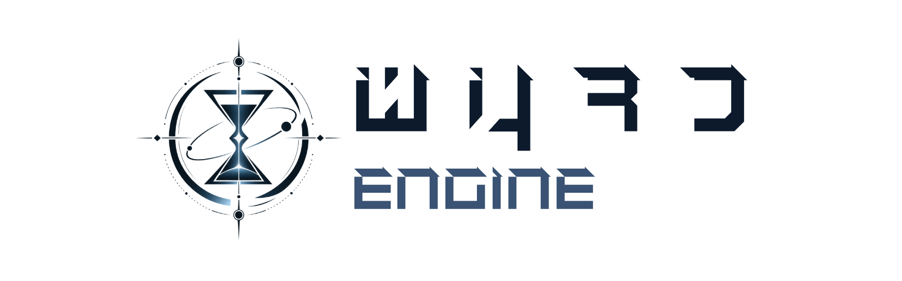
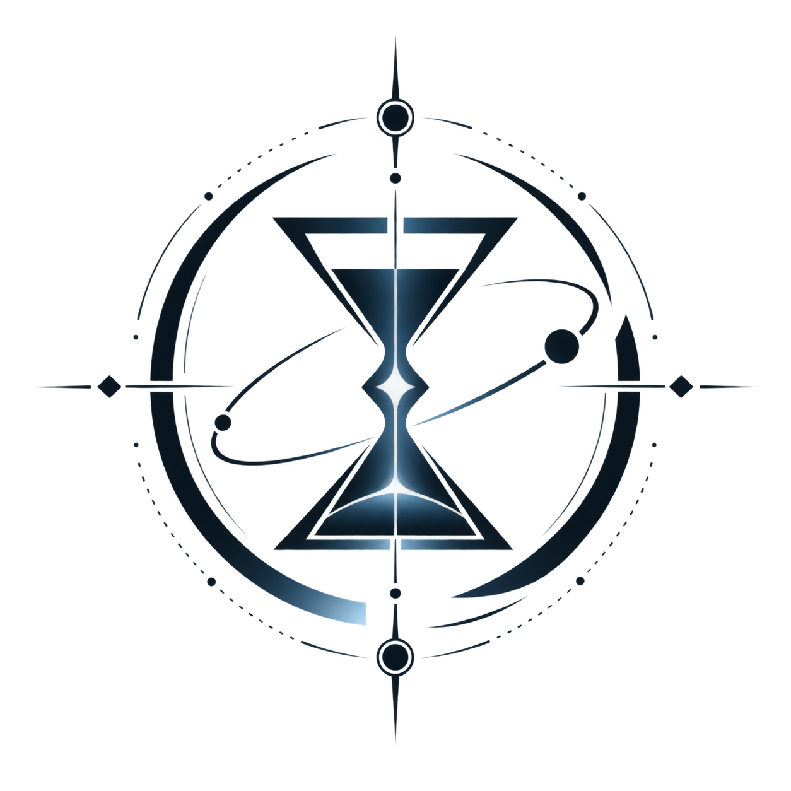
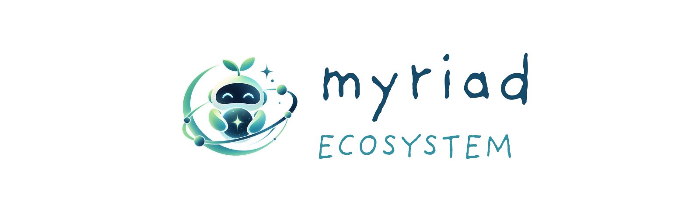
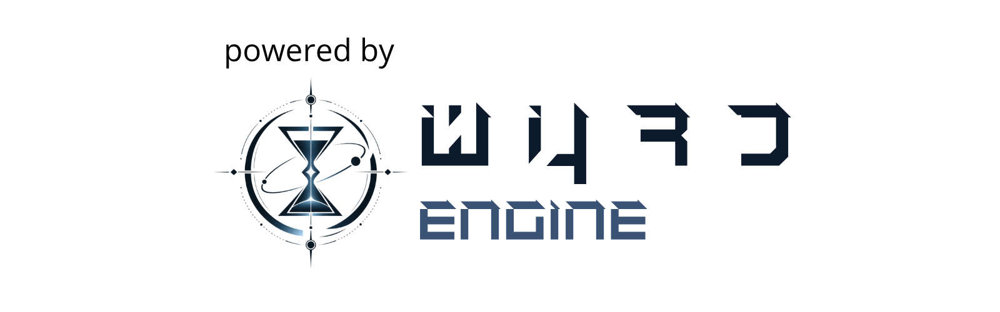

<div align="center">

<a href="#">
  
</a>

<br>

### **An open architecture for structured, connected, temporal knowledge.**

**An Open Source Initiative by Subhradeep Sarkar**

[](#)
[](#tier-i--the-saga-architecture)
[](#tier-ii--wyrd-engine)
[](#tier-iii--the-myriad-ecosystem)

**Architecture · Engine · Ecosystem**

</div>

---

## Branding Asset Map

<div align="center">

| Asset | File | Intended Use |
|---|---|---|
| **The Saga — Cover / Wordmark** | `assets/the-saga-cover.png` | README hero / project identity |
| **Wyrd Engine™ — Cover / Wordmark** | `assets/wyrd-engine.png` | Wyrd Engine™ feature/project section |
| **Wyrd Engine™ — Logo (1:1)** | `assets/wyrd-engine-logo.png` | Wyrd Engine™ mark, icon usage |
| **Myriad Ecosystem — Cover / Wordmark** | `assets/myriad-ecosystem.png` | Ecosystem tier identity |
| **Myriad Ecosystem — Logo (1:1)** | `assets/myriad-ecosystem-logo.png` | Myriad mascot / icon usage |
| **Powered By WYRD ENGINE™** | `assets/powered-by-wyrd-engine.png` | Canonical visual attribution |

</div>

The README uses repository-relative paths so GitHub renders the assets directly from
the repository's `assets/` directory.

---

## Table of Contents

- What is The Saga?
- Why The Saga Exists (Philosophy Summary)
- The Three-Tier Architecture
- Tier I — The Saga Architecture
- Tier II — Wyrd Engine™
- Tier III — The Myriad Ecosystem
- Licensing Model
- Branding Policy (New)
- Powered By WYRD ENGINE™ Policy
- When the Attribution Policy Applies — and When It Does Not
- Versioning & Codenames (Krono)
- What Each Tier Allows / Does Not Allow
- Compliance Matrix
- Examples: Valid & Invalid Interpretations
- Policy Q&A
- Legal Notice

---

## What is The Saga?

**The Saga** is an open-source initiative founded by **Subhradeep Sarkar** to build a
software architecture and ecosystem for **structured, connected, temporal knowledge**.

The Saga treats information not as static files, records, or disconnected pages, but as
something with **identity, state, relationships, and history that evolves through time**.
Full reasoning for *why* this matters lives in the project's Core Philosophy document —
this README defines the *architecture, licensing, and governance* that Philosophy
document motivates.

The Saga is the **umbrella project**. It does not define itself as a single application.
Instead, it is organized into three tiers:

- **Architecture** — the shared conceptual and structural model (Tier I).
- **Wyrd Engine™** — the reference implementation of that model (Tier II).
- **Myriad Ecosystem** — the applications and products built with or around the engine (Tier III).

---

## Why The Saga Exists (Philosophy Summary)

The Saga's Core Philosophy document sets out the problem this project solves: most
software treats information as flat, static, disconnected content, when in reality
information has identity, properties, relationships, state, and history, and all of
these change over time.

The Saga's founding belief, condensed:

> Structure, not semantics. State, not just data. Relationships, not isolation.
> Time, not just timestamps. History, not just the present. Transitions, not just
> static values. Effects, not just connections. Evolution, not just storage.

The engine does not need to understand what a piece of information *means* — only how
it is structured, how it changes, and how it relates to everything around it. Meaning
is supplied by the application, not the engine. This is the design principle that
justifies keeping **Architecture**, **Engine**, and **Ecosystem** as separate,
independently licensed tiers: structure (Tier I) must remain reusable by anyone;
the reference implementation of that structure (Tier II) must remain open; and the
domain-specific meaning built on top of it (Tier III) must remain free to take whatever
form its builders choose.

---

## The Purpose of the Three-Tier Design

The three-tier architecture exists for one reason above all others:

**To promote open-source software, and to serve as a launch pad for indie developers.**

Every licensing decision, every attribution rule, and every branding policy in this
document exists in service of that single purpose — not to restrict what people build,
but to make sure the architecture and the engine remain permanently available as a
foundation other people can build careers, hobbies, and companies on top of.

---

## The Three-Tier Architecture

```text
┌───────────────────────────────────────────────────────────────────────┐
│ TIER I — THE SAGA ARCHITECTURE                                        │
│                                                                       │
│ Graph architecture · WYRD Architecture (1st Gen) · KRONO Architecture │
│ (2nd Gen) · .entity · .lore · relationships · specifications          │
│                                                                       │
│ LICENSE: MIT                                                          │
└───────────────────────────────────────┬───────────────────────────────┘
                                        │ implemented by
                                        ▼
┌───────────────────────────────────────────────────────────────────────┐
│ TIER II — WYRD ENGINE™                                                │
│                                                                       │
│ APIs · runtime · graph operations · serialization · storage · queries │
│ Current stable generation · "Krono" is a version codename, not a      │
│ separate engine                                                       │
│                                                                       │
│ LICENSE: AGPL-3.0                                                     │
└───────────────────────────────────────┬───────────────────────────────┘
                                        │ used by
                                        ▼
┌───────────────────────────────────────────────────────────────────────┐
│ TIER III — THE MYRIAD ECOSYSTEM                                       │
│                                                                       │
│ Applications · tools · integrations · services · products             │
│                                                                       │
│ LICENSE: PRODUCT-SPECIFIC                                             │
│ ATTRIBUTION: **Powered By WYRD ENGINE™** where the policy applies      │
└───────────────────────────────────────────────────────────────────────┘
```

### The Critical Rule

**Do not collapse the three tiers into one license.**

- The MIT license of Tier I does **not** make Tier II MIT.
- The AGPL-3.0 license of Tier II does **not** make Tier I AGPL.
- A Tier III product does **not** inherit a universal Saga license.

Each tier has its own boundary, exactly as before rebranding — only the names have changed.

---

## Tier I — The Saga Architecture

### Definition

**The Saga Architecture** (referred to simply as **"Architecture"**, or in full as
**"Saga's Architecture"**) is the graph-oriented, temporal, structural model on which
Wyrd Engine™ is built. It is not a GitHub repository, and it is not documentation alone
— it is the conceptual and structural body of ideas that defines what a Saga-compatible
system represents.

Architecture is organized into two generations:

| Generation | Name | Description |
|---|---|---|
| **1st Gen** | **WYRD Architecture** | The original graph model, entities, relationships, properties, identity, traversal, and the `.entity` / `.lore` specifications. |
| **2nd Gen** | **KRONO Architecture** | Builds on the 1st Gen model without turning it into a monolith. Adds explicit models for entities, connected lore, event-driven evolution, relationship history, and semantic time. |

Both generations of Architecture are **Tier I** material, released under the **MIT License**.

### Core Architectural Scope

Architecture covers, across both generations:

- The graph-oriented, temporal architecture.
- The `.entity` design concept (identity, properties, typed values, validation).
- The `.lore` design concept (relationships, claims, states, events, temporal context).
- Structured objects and first-class relationships.
- State, transition, and effect semantics.
- Shared conceptual vocabulary and structural conventions.
- Interoperability and serialization concepts.

### MIT License — What You May Do

You may study, copy (where distributed under MIT), modify, extend, adapt, reimplement,
translate into another language, build a new implementation from, use commercially,
use privately, combine with other software, and build proprietary **or** open
implementations of Architecture. You may create competing engines and competing
applications. Using Architecture does not require using Wyrd Engine™, any particular
language, or any Myriad Ecosystem application.

---

## Tier II — Wyrd Engine™

<div align="center">



<br><br>



</div>

### Definition

**Wyrd Engine™** is the reference software implementation of Saga's Architecture — the
actual software that applications execute, reference, link against, embed, bundle,
extend, or otherwise incorporate: entity management, relationship management, graph
operations, data models, serialization, parsing, storage, querying, validation, APIs,
runtime services, and supporting infrastructure.

**Wyrd Engine™** is licensed under **GNU AGPL-3.0**.

### Version Codenames Are Not New Engines

Wyrd Engine™ will continue to receive major version upgrades over time, and each major
version may carry a codename. The current in-development 2nd major version, currently
in **Beta**, is codenamed **Krono**.

**This must be read unambiguously:**

> A codename identifies a **version of Wyrd Engine™**, not a separate or independent
> engine. "Wyrd Engine™ 2 (Krono)", "Wyrd Engine™ (Krono)", and "Krono" all refer to the
> same underlying software lineage as "Wyrd Engine™" — they are **version upgrades**,
> governed by the same **AGPL-3.0** license, under the same **WYRD ENGINE™** trademark.
> No codename may be used to imply that a version is a distinct product, a fork with
> different licensing terms, or an unrelated engine.

Future major versions may introduce further codenames. The same rule applies to all of
them: a codename is a version label under the Wyrd Engine™ umbrella, never a rebrand
away from it.

### Core Rule

**The MIT license of Saga's Architecture does not convert Wyrd Engine™ into MIT
software. The AGPL-3.0 license of Wyrd Engine™ does not convert Architecture into
AGPL-3.0 material.** Each tier keeps its own license boundary.

---

## Tier III — The Myriad Ecosystem

<div align="center">



<br><br>


</div>

### Definition

**The Myriad Ecosystem** is the collection of applications, products, services, tools,
integrations, libraries, visualizers, experiments, and other software built with or
around Wyrd Engine™ and Saga's Architecture.

The ecosystem is product-specific. There is no single mandatory application license for
the entire ecosystem. A Myriad product can have its own license, business model, UI,
distribution model, pricing model, hosting model, name, brand, feature set, and
audience — subject to the licenses of the components it actually uses.

### The Ecosystem Is Not a License

"Myriad Ecosystem" is a classification, not a license. It does not automatically grant
permission to relicense Wyrd Engine™, does not replace AGPL-3.0, does not turn MIT
architectural material into proprietary material, and does not create a universal
license for third-party products.

---

## Licensing Model

| Tier | Name | License |
|---|---|---|
| **Tier I** | The Saga Architecture (WYRD Architecture, KRONO Architecture) | **MIT** |
| **Tier II** | Wyrd Engine™ (including all versions/codenames, e.g. Krono) | **AGPL-3.0** |
| **Tier III** | The Myriad Ecosystem | **Product-Specific** |

A product's own license does not erase the license of a component it incorporates.
Using an MIT architectural concept does not impose the license of any implementation
that happens to share that architecture.

---

## Branding Policy (New)

The Saga separates **software licensing** from **brand permission**. Each tier has a
distinct branding posture:

### Tier I — Architecture: No Restrictions

Architecture is pure open source under MIT. There are **no branding limits** at this
tier beyond ordinary MIT terms (preserve the license/copyright notice on material you
actually copy). You may reimplement, rename, rebrand, and redistribute your own
independent implementation of the Architecture however you like. You do **not** need
permission, attribution, or a specific label to build an independent engine from the
Architecture alone.

### Tier II — Wyrd Engine™: A Launch Pad, With One Condition

Subhradeep Sarkar welcomes any developer — commercial or hobbyist, indie or studio — to
build on and launch from the **WYRD ENGINE™** brand, on exactly one condition:

> **You must actually use, modify, fix, extend, or otherwise build upon the real
> Wyrd Engine™ source code.**

If you meet that condition, you are welcome to use the WYRD ENGINE™ name as your
launch pad — for example, describing your product as "Built on WYRD ENGINE™" or
"A WYRD ENGINE™ project" — subject to the AGPL-3.0 obligations that come with using the
actual source.

If you do **not** use the actual Wyrd Engine™ source code — for example, you
independently reimplemented Saga's Architecture from scratch in your own engine — you
may **not** call your engine "WYRD ENGINE™," a version of it, or otherwise imply it is
the same lineage. Instead, such an independent, from-scratch engine may describe
itself, without needing anyone's permission, as:

> **"A Derivative of WYRD ENGINE™"**

This label may be used freely by independent implementations that follow the
Architecture but do not incorporate Wyrd Engine™ source code — no permission is
required to use this specific phrase, provided it is used honestly (i.e., the product
genuinely follows Saga's Architecture concepts and is not attempting to imply it is the
literal Wyrd Engine™ or an official release of it).

This is deliberate: **the trademark is a launch pad, not a gate.** If you touch the real
source, the brand is yours to build on. If you didn't, you still get an honest, legal
way to signal your lineage — you just can't call yourself the thing you didn't build.

### Tier III — Myriad Ecosystem: Product-Specific Branding

Ecosystem products choose their own names, brands, and identities freely. They must not
misrepresent themselves as official Saga / Wyrd Engine™ / Myriad releases, and where
they use Wyrd Engine™, the attribution policy below applies.

---

## Powered By WYRD ENGINE™ Policy

<div align="center">



</div>

### Purpose

**Powered By WYRD ENGINE™** identifies software that relies on Wyrd Engine™, giving
users clear provenance and a visible link between an ecosystem product and the engine
providing its Saga functionality.

### Official Attribution Statement

> **Powered By WYRD ENGINE™**
>
> **Powered By WYRD ENGINE™** is the official attribution for products built using
> Wyrd Engine™.

### Scope Rule — Independent Developer vs. Formally Organized Project

The attribution requirement is scaled to the **organizational status** behind a
project — never to revenue, price, monetization, popularity, funding, or commercial
success. Two categories exist:

> **Independent Developer**
>
> An **Independent Developer** is an individual or informal team operating
> independently, without a registered company, studio, organization, publisher, or
> other formally organized entity behind the project. This includes:
> - A solo developer, including one selling a paid product.
> - A solo developer earning significant or substantial revenue.
> - A small informal indie team — e.g., three developers working together informally.
> - Hobbyists, students, and personal projects.
>
> Independent Developers may use Wyrd Engine™ for free **or** paid products, including
> commercial products, **without being required** to display
> **Powered By WYRD ENGINE™**. Attribution is strongly encouraged, but remains
> **voluntary**.

> **Formally Organized Project**
>
> A **Formally Organized Project** is a project operated by or on behalf of a
> registered company, studio, organization, foundation, publisher, or other formally
> established entity. This includes:
> - A registered company or studio.
> - An incorporated or formally organized commercial team.
> - A publisher-backed or formally funded studio.
> - A foundation, organization, or other formally structured group.
>
> **Powered By WYRD ENGINE™** is **mandatory** for such projects, in a practical,
> user-facing location, for as long as they use Wyrd Engine™.

### Important Clarification — Revenue Does Not Change the Category

**Revenue or monetization alone does not turn an Independent Developer into a Formally
Organized Project.** A solo developer may sell a product, charge money, operate a
profitable business, or earn substantial revenue while remaining an Independent
Developer under this policy. Likewise, an informal indie team may release a paid
product without becoming subject to mandatory attribution solely because the product
generates revenue.

The determining factor is **the organizational structure behind the project** — not
the project's financial success. Accordingly, this policy does **not** base the
mandatory/voluntary distinction on any of the following:

- Revenue
- Product price
- Monetization model
- Whether the product is free or paid
- Project popularity
- Funding amount
- Commercial success

### Simple Rule

> **Individual / informal indie team → Attribution encouraged, not mandatory.**
> **Registered company / studio / organization / formally organized team →
> Attribution mandatory.**

If a project's organizational status is genuinely unclear, err on the side of
displaying the attribution — it is never wrong to do so, and it is always appreciated.

### Why This Policy Exists

This policy exists to keep Wyrd Engine™ a genuine launch pad for indie developers,
rather than creating unnecessary branding obligations for the very developers the
project is intended to support. An Independent Developer's commercial success is not
treated as a reason to impose obligations that were designed for formally organized
entities.

### No Implication of Official Status

Regardless of category, **any project displaying the attribution — mandatory or
voluntary — must not imply that it is an official Wyrd Engine™ or Saga Project
product, nor that it is endorsed, certified, or reviewed by The Saga Project.** The
attribution identifies a dependency, not a partnership. Phrasing such as "an official
Wyrd Engine™ title," "certified by The Saga Project," or similar implications of
formal endorsement is not permitted for any project regardless of size or category,
unless official status has been separately and explicitly granted by Subhradeep
Sarkar or the project.

### No Substitute Wording (Where Attribution Is Used)

Whether displayed by mandate or by choice, the phrase must not be reworded, e.g.
"Made with Wyrd Engine," "Uses Saga," "Built on Saga," "Powered by Saga," "Wyrd Engine
inside," "Based on Wyrd," or similar substantially different phrasing. The trademark
symbol should be preserved wherever the phrase is used in a formal or product-facing
context.

### Required Placement (For Mandatory Cases)

Where the attribution is mandatory (Formally Organized Projects), it must appear
somewhere a reasonable user, developer, distributor, or evaluator encountering the
product in its normal form would discover it:

- **Desktop app:** About screen, application information dialog, credits, or
  startup/splash screen.
- **Web app:** Footer, About page, or legal page.
- **CLI:** Help output, version output, or startup information.
- **Library:** README, package documentation, or package metadata.
- **Hosted service:** Product information page, About page, or documentation.
- **Distribution package:** Package documentation, installer, or product README.

A collapsed legal menu, buried source comment, or inaccessible internal file is not
treated as sufficient placement for a mandatory case when a practical user-facing
location exists. Independent developers displaying the attribution voluntarily are
free to place it wherever they like — any visible placement is welcomed.

### Branding Versus Software License

This attribution requirement is intentionally separate from AGPL-3.0 itself. AGPL-3.0
governs the copyright license of Wyrd Engine™; the Powered By WYRD ENGINE™ requirement
is a Myriad Ecosystem branding and trademark policy layered alongside it, not a term
that adds restrictions to the AGPL copyright grant itself. Do not conflate the two: a
product can be in full AGPL-3.0 source compliance and still fail this branding policy
if it omits the required attribution, and vice versa — the two obligations are
evaluated independently.

### Attribution Is Not Ownership, Endorsement, or Official Status

Displaying the phrase does not mean The Saga owns the product, endorses it, certifies
it, audits it, or guarantees it. A product must not claim official Saga / Myriad status
merely because it displays the required attribution — official status is separately
and explicitly designated by Subhradeep Sarkar or the project.

### If a Formally Organized Project Stops Qualifying

If a Formally Organized Project removes its dependency on Wyrd Engine™, the
attribution should be removed or corrected to reflect the actual dependency. If a
Formally Organized Project stops displaying the attribution while still using
Wyrd Engine™, it should be treated as non-compliant with this policy until corrected.
Independent Developers who choose to stop displaying a voluntary attribution are not
in violation of anything by doing so.

---

## Versioning & Codenames (Krono)

| Layer | Current | Notes |
|---|---|---|
| Architecture | WYRD Architecture (1st Gen), KRONO Architecture (2nd Gen) | Two architecture generations, both MIT. |
| Engine | Wyrd Engine™ (stable), Wyrd Engine™ 2 "Krono" (Beta) | Krono is a **version codename** of Wyrd Engine™, not a separate engine — see Tier II above. |
| Ecosystem | Myriad Ecosystem products | Each product versions independently. |

Products should document which Architecture generation and which Wyrd Engine™ version
(including codename, if any) they target, e.g.:

```text
Product: Example Graph Studio
Wyrd Engine™: 2.x ("Krono", Beta)
Saga Architecture: KRONO Architecture
Product License: MIT
Attribution: Powered By WYRD ENGINE™ (required — Formally Organized Project)
```

---

## What Each Tier Allows / Does Not Allow

### Tier I — Allowed
Copying, modifying, extending, reimplementing, competing, commercializing, and
privately using Architecture material distributed under MIT — with no branding
restriction at this tier.

### Tier I — Not Automatically Granted
Trademark rights, rights to misrepresent authorship, rights over material not actually
distributed under MIT, or rights over third-party components.

### Tier II — Allowed
Running, studying, modifying, and sharing Wyrd Engine™ under AGPL-3.0; using the
WYRD ENGINE™ brand as a launch pad **if** you build on the actual source code.

### Tier II — Not Allowed
- Treating Wyrd Engine™ (any version or codename) as MIT.
- Presenting a version codename (e.g. "Krono") as an unrelated or separately licensed
  engine.
- Using the WYRD ENGINE™ name or "a version of Wyrd Engine™" for an engine that does
  not actually incorporate Wyrd Engine™ source — use "A Derivative of WYRD ENGINE™"
  instead.
- Stripping AGPL obligations, replacing the license, or misrepresenting modified engine
  code as unmodified upstream.
- Omitting the Powered By WYRD ENGINE™ attribution once a project qualifies as a
  Formally Organized Project under the policy above.

### Tier III — Allowed
Choosing a product's own license, business model, name, and brand, subject to
component licenses and the attribution policy above.

### Tier III — Not Allowed
Claiming all Myriad products share one license; claiming the ecosystem designation
alone means official status; using the attribution to imply endorsement or official
Wyrd Engine™ / Saga Project status; a Formally Organized Project omitting the mandatory
attribution; basing the mandatory/voluntary determination on revenue, price,
monetization, popularity, funding, or commercial success rather than organizational
structure.

---

## Compliance Matrix

| Action | Tier I | Tier II | Tier III |
|---|---|---|---|
| Study / reimplement architecture | Allowed | N/A | Allowed subject to components |
| Copy or modify Wyrd Engine™ source | N/A | AGPL-3.0 applies | AGPL-3.0 applies |
| Call an independent engine "WYRD ENGINE™" | N/A | Not allowed unless real source used | Not allowed |
| Call an independent engine "A Derivative of WYRD ENGINE™" | N/A | Allowed, no permission needed | Allowed |
| Independent Developer (solo or informal team) uses Wyrd Engine™, free or paid | N/A | AGPL-3.0 applies | Attribution strongly encouraged, not mandatory |
| Formally Organized Project (company/studio/organization/foundation) uses Wyrd Engine™ | N/A | AGPL-3.0 applies | Attribution **mandatory** |
| Display Powered By WYRD ENGINE™ only in source comments / ToS (mandatory case) | N/A | N/A | Not sufficient — practical user-facing placement required |
| Claim official Saga / Myriad / Wyrd Engine™ status via the attribution | Not automatic | Not automatic | Not automatic, for anyone |

---

## Examples: Valid & Invalid Interpretations

### Valid

- A developer reimplements Saga's Architecture from scratch in Rust, ships it as a
  proprietary product, and labels it "A Derivative of WYRD ENGINE™." No permission
  needed; no Powered By attribution required since Wyrd Engine™ source isn't used.
- A solo developer forks Wyrd Engine™ and sells a paid indie game as an unaffiliated
  individual, earning substantial revenue from it. Attribution remains strongly
  encouraged but **not mandatory** — they are an Independent Developer, and revenue
  does not change that.
- Three developers working together informally, with no registered entity, release a
  paid commercial product built on Wyrd Engine™. They remain an Independent Developer
  team under this policy; attribution stays voluntary.
- A registered studio embeds Wyrd Engine™ 2 ("Krono", Beta) in its product. AGPL-3.0
  applies to the engine, and Powered By WYRD ENGINE™ is **mandatory** and must be
  clearly placed, because the studio is a Formally Organized Project — independent of
  whether the product itself is free or paid.

### Invalid

- "Our engine is inspired by the Architecture, so we can call it WYRD ENGINE™ Lite."
  — Incorrect. No Wyrd Engine™ source is used; the correct label is "A Derivative of
  WYRD ENGINE™."
- "Krono is a separate free engine from Wyrd Engine™, so AGPL doesn't apply to it." —
  Incorrect. Krono is a version codename of Wyrd Engine™ and is fully AGPL-3.0.
- "This solo developer makes a lot of money from their Wyrd Engine™ game, so
  attribution should be mandatory for them." — Incorrect. Revenue and commercial
  success never convert an Independent Developer into a Formally Organized Project.
- "We're a funded studio, but our game is free, so attribution doesn't apply to us." —
  Incorrect. The mandatory/voluntary line is drawn by who is building the product
  (organization vs. independent developer), not by whether it's monetized.
- "We display the attribution, so we can call ourselves an official Wyrd Engine™
  studio." — Incorrect. Displaying the attribution never implies official status,
  endorsement, or certification for anyone, mandatory or voluntary.

---

## Policy Q&A

**Can I implement The Saga Architecture in another language?**
Yes — Architecture is MIT, with no branding restriction.

**Can I make my independent implementation proprietary?**
Yes, provided it is genuinely independent of Wyrd Engine™ source.

**Can I call my independent implementation "WYRD ENGINE"?**
No, unless it actually incorporates Wyrd Engine™ source. Use "A Derivative of
WYRD ENGINE™" instead — no permission required for that phrase.

**Is Krono a different engine than Wyrd Engine™?**
No. Krono is a version codename (currently Beta) for Wyrd Engine™ 2. Same license,
same trademark, same lineage.

**Do I have to display Powered By WYRD ENGINE™ as an Independent Developer or
hobbyist?**
No — it's strongly encouraged but not mandatory for Independent Developers, hobbyists,
and small informal indie teams, regardless of whether the project is free or paid.

**I'm a solo developer and my product makes significant revenue. Does that make
attribution mandatory for me?**
No. Revenue, price, monetization, popularity, funding, and commercial success never
change an Independent Developer into a Formally Organized Project. You remain an
Independent Developer, and attribution stays voluntary.

**Do I have to display it if I'm a registered studio, company, or organization?**
Yes — mandatory for Formally Organized Projects (registered companies, studios,
organizations, foundations, publisher-backed or formally funded teams), for as long as
the project uses Wyrd Engine™.

**Can displaying the attribution ever imply my product is official or endorsed?**
No, for anyone. The attribution identifies a dependency, not a partnership — official
status must be separately and explicitly granted.

**Can I hide the mandatory attribution in a third-party notices file only?**
No — not when a practical user-facing location exists.

**Does using Wyrd Engine™ make my own source code MIT or open source?**
No. Wyrd Engine™ remains AGPL-3.0; your own product code follows whatever license you
choose, subject to AGPL-3.0 obligations on the parts that incorporate the engine.

**What is the purpose of the three-tier system?**
To promote open-source software and to serve as a launch pad for indie developers —
nothing more, nothing less.

---

## Legal Notice

This README is a project policy and documentation statement, not legal advice. The
full legal terms of the GNU Affero General Public License, Version 3, control the
licensing of Wyrd Engine™. The MIT license controls the materials actually distributed
under the MIT license. Trademark rights in **WYRD ENGINE™** are asserted separately
from software copyright licensing. Where a question involves a combined work,
distribution structure, trademark rights, copyright scope, or jurisdiction-specific
law, obtain professional legal advice.

---

<div align="center">


**The Saga**

*An open architecture for structured, connected, temporal knowledge.*

**Architecture. Engine. Ecosystem. A launch pad for indie developers.**

<br>


</div>
