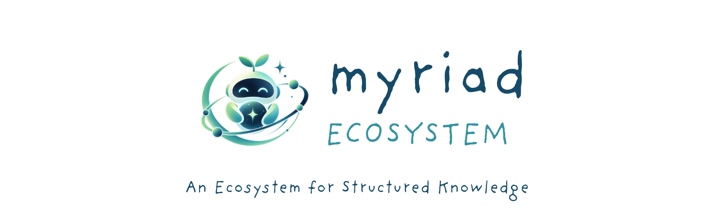
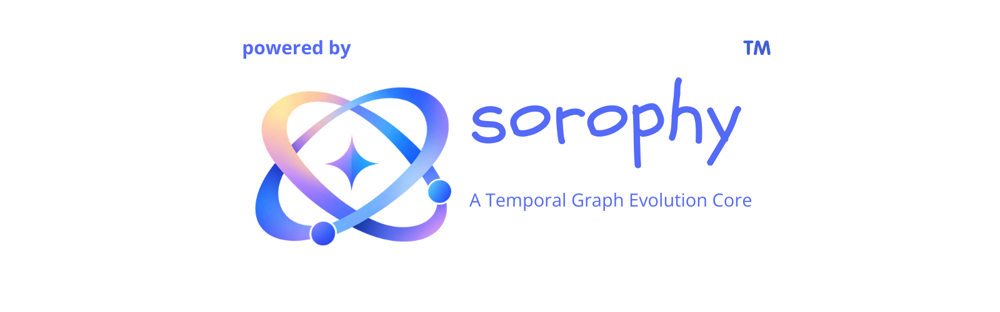

<div align="center">


<br>

**An open architecture for structured, connected, temporal knowledge.**

An open source initiative by Subhradeep Sarkar

[](#)
[](#tier-i--the-saga-architecture)
[](#tier-ii--sorophy)
[](#tier-iii--the-myriad-ecosystem)
[](#branding)

</div>

---

## Contents

- [What is The Saga](#what-is-the-saga)
- [Why it exists](#why-it-exists)
- [The three tiers](#the-three-tiers)
- [Tier I — The Saga Architecture](#tier-i--the-saga-architecture)
- [Tier II — Sorophy](#tier-ii--sorophy)
- [Tier III — The Myriad Ecosystem](#tier-iii--the-myriad-ecosystem)
- [Licensing at a glance](#licensing-at-a-glance)
- [Branding](#branding)
- [Powered By Sorophy™](#powered-by-sorophy)
- [Versioning and codenames](#versioning-and-codenames)
- [The Saga umbrella](#the-saga-umbrella)
- [Saga Attribution Policy for contributors](#saga-attribution-policy-for-contributors)
- [Assets](#assets)
- [Legal notice](#legal-notice)

---

## What is The Saga

The Saga is an open source initiative I started to explore a simple idea: information
isn't static. It has identity, state, relationships, and a history — and it changes
over time. Most software treats data as flat records. The Saga treats it as a
structured, temporal graph instead.

The Saga isn't a single application. It's organized as three independent tiers:

- **The Saga Architecture** — the underlying model. (Tier I)
- **Sorophy™** — the reference implementation of that model. (Tier II)
- **The Myriad Ecosystem** — the applications built with or around it. (Tier III)

Each tier has its own license and its own boundary, and none of them absorb one
another.

---

## Why it exists

The project's Core Philosophy document goes into this in depth, but the short version:
a computer doesn't need to understand what a piece of information *means* to
understand how it's structured, how it changes, and what it's connected to. Meaning
belongs to the application. Structure belongs to the architecture.

That separation is why Architecture, Sorophy™, and Ecosystem are kept as distinct,
independently licensed layers. The architecture should stay reusable by anyone.
Sorophy™ itself should stay open. And whatever people build on top should remain
entirely theirs to shape.

The three-tier design exists for one purpose above all: to keep this useful as a
foundation other people can build on — as a hobby, a career, or a company — without
asking permission first.

---

## The three tiers

```text
Tier I — The Saga Architecture        MIT
        │  implemented by
        ▼
Tier II — Sorophy™                    AGPL-3.0
        │  used by
        ▼
Tier III — The Myriad Ecosystem       Product-specific
```

Each tier's license stays with that tier. MIT at Tier I doesn't make Sorophy™ MIT.
AGPL-3.0 at Tier II doesn't make the Architecture AGPL. A Myriad product doesn't
inherit a single umbrella license just by existing in the ecosystem.

---

## Tier I — The Saga Architecture

The Architecture is the graph-oriented, temporal model underneath everything else —
not a repository, not documentation, but the conceptual structure itself: entities,
relationships, state, time, and how they interact.

It has two generations so far:

| Generation | Name | Covers |
|---|---|---|
| 1st | **WYRD Architecture** | The original graph model — entities, relationships, properties, identity, and the `.entity` / `.lore` specifications. |
| 2nd | **KRONO Architecture** | Builds on the first without becoming a monolith — adds explicit models for event-driven evolution, relationship history, and semantic time. |

Both generations are released under the **MIT License**.

**In practice, that means** you're free to study it, copy it, modify it, reimplement
it in another language, and build commercial or open products from it — including
implementations that compete directly with Sorophy™. Using the Architecture never
requires using Sorophy™.

---

## Tier II — Sorophy

<div align="center">


</div>

**Sorophy™** is the reference implementation of the Saga Architecture — the software
behind entity management, relationship handling, graph operations, serialization,
storage, and querying.

It's licensed under **GNU AGPL-3.0**.

### Version codenames

Sorophy™ receives major version upgrades over time, and each one may carry a
codename. The current major version in development, currently in beta, is codenamed
**Krono**.

A codename names a version of Sorophy™ — not a separate product. "Sorophy™ 2 (Krono)"
and "Sorophy™" are the same lineage, under the same license, under the same
trademark. No future codename should be read as a fork or a different product.

---

## Tier III — The Myriad Ecosystem

<div align="center">



</div>

The Myriad Ecosystem is everything built with or around Sorophy™ and the Saga
Architecture — applications, tools, integrations, services, whatever people make of
it.

There's no single license across the ecosystem. Each product chooses its own — its own
pricing, its own brand, its own distribution model — subject only to the licenses of
the components it actually uses. "Myriad Ecosystem" describes a category, not a
license, and it doesn't grant permission to relicense anything underneath it.

---

## Licensing at a glance

| Tier | Name | License |
|---|---|---|
| I | The Saga Architecture | MIT |
| II | Sorophy™ (all versions and codenames) | AGPL-3.0 |
| III | The Myriad Ecosystem | Product-specific |

A product's own license never erases the license of what it depends on, and using an
MIT-licensed concept never imposes the license of whatever happens to implement it.

---

## Branding

Licensing and brand permission are two separate questions here.

**Tier I — Architecture.** No restrictions beyond ordinary MIT terms. Rename it,
rebrand it, build a competing implementation from it — no permission needed.

**Tier II — Sorophy™.** The trademark is meant to work as a launch pad for indie
developers, and the rule that makes that possible is a firm one: **the Sorophy™ name
may only be used by projects that actually build on the real Sorophy™ source** —
using it, modifying it, or extending it. If that condition is met, using the name is a
right, not a favor: "Built on Sorophy™" is yours to say.

If the Sorophy™ source isn't part of your project — for instance, an independent
implementation written from scratch after studying the Architecture — **the name
"Sorophy™" may not be used for it, in any form, including as a version, a variant, or
an implied successor.** The correct and only acceptable label for such a project is:

> "A Derivative of Sorophy™"

This phrase is available to use without asking, provided it's accurate. Anything that
suggests direct lineage to Sorophy™ without the underlying source is a misuse of the
trademark, regardless of intent.

**Tier III — Myriad Ecosystem.** Products choose their own names and identities
freely. What they may not do is represent themselves as officially Saga- or Sorophy™-
affiliated without that status having been explicitly granted. This applies
regardless of how the product is licensed, priced, or distributed.

---

## Powered By Sorophy™

<div align="center">



</div>

**"Powered By Sorophy™"** is the required attribution phrase for products built on
Sorophy™. Whether it's required of a given project depends on one factor only:
**who's behind it** — never revenue, price, popularity, or monetization.

[](#powered-by-sorophy)

**Independent developers** — a solo developer, an informal team, hobbyists, students —
are not required to display it, including for paid, commercial, or high-revenue work.
A personal sole proprietorship or single-member LLC formed for tax or liability
purposes does not change this: what determines the category is whether a separate
organization or team stands behind the project, not the legal wrapper one person
chose. Attribution remains welcome here, but it is not enforced.

**Formally organized projects** — a registered company, studio, foundation, or
publisher-backed team — **must** display it for as long as they use Sorophy™, placed
somewhere a user would actually see it: an About screen, a footer, help or version
output, or product documentation. A source-code comment or a buried legal page does
not satisfy this — placement that can't reasonably be found is treated as
non-compliant.

The following apply without exception:

- Revenue, pricing, and monetization never change which category a project falls
  into, and never excuse a formally organized project from displaying the
  attribution.
- Displaying the phrase never implies official Saga or Sorophy™ status, endorsement,
  or certification — it names a dependency, nothing more.
- The exact phrase must be used as written. Substitutions ("Built on Saga," "Uses
  Sorophy," or similar rewordings) do not satisfy this policy.
- Where the attribution is required and a project stops meeting that requirement, it
  should be treated and corrected as a compliance issue, not a stylistic choice.

If a project's organizational status is genuinely unclear, the safer assumption is
that the attribution applies.

---

## Versioning and codenames

| Layer | Current | Note |
|---|---|---|
| Architecture | WYRD (1st gen), KRONO (2nd gen) | Both MIT. |
| Sorophy™ | Stable, and 2 "Krono" (beta) | Krono is a version, not a separate product. |
| Ecosystem | Myriad Ecosystem products | Each versions independently. |

A product might document itself like this:

```text
Product: Example Graph Studio
Sorophy™: 2.x ("Krono", beta)
Saga Architecture: KRONO
Product license: MIT
Attribution: Powered By Sorophy™ — developed by a registered studio
```

---

## The Saga umbrella

The Saga is an umbrella for the architecture, Sorophy™, and whatever software is
formally developed under its name. That's an important distinction: **using** Saga
technology and **being part of** The Saga are not the same thing.

The vast majority of software built with Sorophy™ or the Architecture will, quite
correctly, remain fully independent — and that's by design. Formal inclusion under
The Saga is something I extend deliberately, to projects and contributors with a
genuine, acknowledged relationship to this work. It isn't a status a project can
claim for itself just by using the technology, however extensively.

Software recognized under The Saga generally falls into one of these:

- **The Saga Architecture** and **Sorophy™** themselves.
- **The Myriad Ecosystem** — applications and tools built within it.
- **Saga Projects** — software formally developed under the umbrella.
- **Saga Contributors' Projects** — independent work by contributors who choose to
  participate in the ecosystem.

---

## Saga Attribution Policy for contributors

Some contributors and Saga-affiliated projects may want to extend a similar,
developer-friendly attribution approach to their *own* software. This is offered as a
courtesy to people who've genuinely engaged with the project — not something available
by default.

**Who this is for.** Anyone who has meaningfully contributed to The Saga, or whose
project was formally developed under the Saga umbrella.

**How it works.** Entirely optional. If you qualify, you can choose to apply the same
attribution principles to your own commercial or non-commercial work — no one is ever
required to.

**What it doesn't do.** It doesn't transfer ownership of your software to The Saga.
Your copyright, license, trademarks, branding, and commercial terms all remain
entirely yours. And adopting it never implies official endorsement or affiliation
unless that's been separately and explicitly granted — eligibility can also be
reviewed if the underlying relationship it was based on no longer holds.

---

## Assets

| File | Use |
|---|---|
| `assets/the-saga-cover.png` | The Saga — hero / wordmark |
| `assets/sorophy-cover.png` | Sorophy™ — wordmark and tagline |
| `assets/sorophy-logo.png` | Sorophy™ — mark (1:1) |
| `assets/myriad-ecosystem-cover.png` | Myriad Ecosystem — wordmark and tagline |
| `assets/myriad-ecosystem-logo.png` | Myriad Ecosystem — mark (1:1) |
| `assets/powered-by-sorophy-cover.png` | Canonical attribution graphic |

All paths are repository-relative, so they render directly from this repo's `assets/`
folder.

---

## Legal notice

This document is a project policy statement, not legal advice. Sorophy™'s licensing is
governed by the full text of the GNU Affero General Public License, Version 3. MIT
governs the Architecture materials actually distributed under it. Trademark rights in
**Sorophy™** are asserted separately from copyright licensing. For anything involving
combined works, distribution structure, or jurisdiction-specific questions, please
seek independent legal advice.

---

<div align="center">


<sub>Architecture, Sorophy™, ecosystem — a foundation meant to be built on.</sub>

<br><br>


</div>
