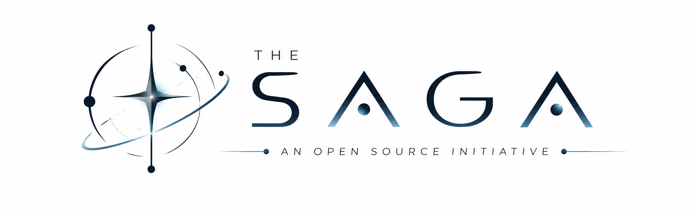
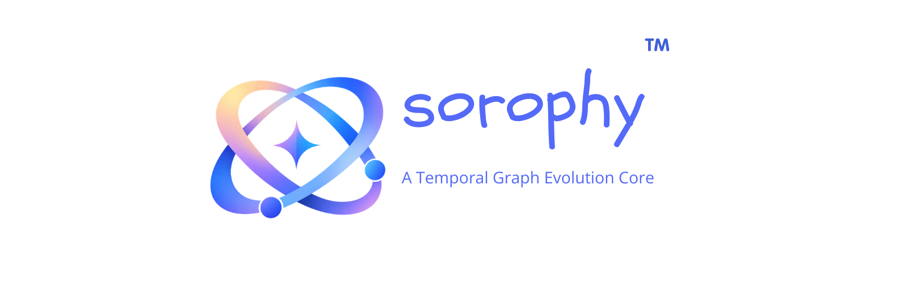
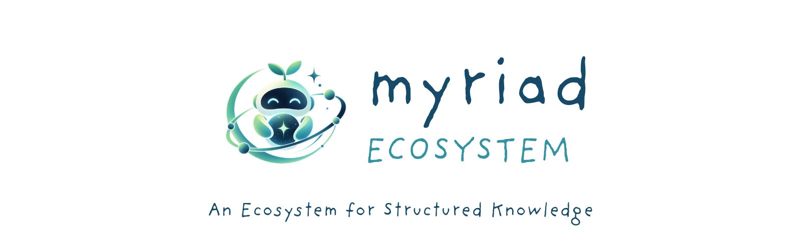
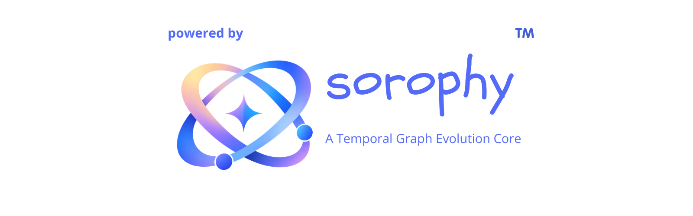

<div align="center">



<br>

Specifications and documentation for The Saga architecture, reference engine, and ecosystem.

[](#)
[](#tier-i--saga-architecture)
[](#tier-ii--sorophy)
[](#tier-iii--the-myriad-ecosystem)
[](#trademark-and-naming-guidelines)

</div>

---

## Contents

- [Overview](#overview)
- [Repository Structure](#repository-structure)
- [System Architecture](#system-architecture)
  - [Tier I: Saga Architecture](#tier-i--saga-architecture)
  - [Tier II: Sorophy](#tier-ii--sorophy)
  - [Tier III: The Myriad Ecosystem](#tier-iii--the-myriad-ecosystem)
- [Licensing](#licensing)
- [Trademark and Naming Guidelines](#trademark-and-naming-guidelines)
- [Attribution Policy](#attribution-policy)
- [Contributor Recognition](#contributor-recognition)
- [Repository Assets](#repository-assets)
- [Legal Notice](#legal-notice)

---

## Overview

The Saga defines a specification and reference model for managing graph-structured data with temporal history, entity state tracking, and explicit relationship evolution over time.

The project is organized into three discrete tiers:

1. **The Architecture (Tier I)**: Open specifications defining the graph model, data formats (`.entity`, `.lore`), and temporal semantics.
2. **Sorophy (Tier II)**: The reference implementation engine for entity management, storage, serialization, and query processing.
3. **The Myriad Ecosystem (Tier III)**: Independent tools, user interfaces, and domain applications built on top of Sorophy or the architecture specifications.

Each tier maintains its own license and dependency boundaries.

---

## Repository Structure

```text
The Saga Documentation/
├── architecture/
│   ├── WYRD/                  # 1st-generation graph & entity format specifications
│   │   ├── entity.md
│   │   ├── graph.md
│   │   └── lore.md
│   └── KRONO/                 # 2nd-generation temporal & event-driven architecture
│       ├── ARCHITECTURE.md
│       ├── ENTITY_MODEL.md
│       ├── EVENTS_AND_EVOLUTION.md
│       ├── HISTORY.md
│       ├── LORE_MODEL.md
│       └── TEMPORAL_MODEL.md
├── recognition/               # Contributor policies, badges, and grant registry
│   ├── README.md
│   ├── Recognition Policy.md
│   ├── Registry.md
│   └── ...
└── assets/                    # Project logos, diagrams, and badge graphics
```

---

## System Architecture

```text
Tier I: Saga Architecture (Specifications)
        │
        ▼ implemented by
Tier II: Sorophy™ (Reference Engine)
        │
        ▼ consumed by
Tier III: Myriad Ecosystem (Applications & Integrations)
```

### Tier I — Saga Architecture

Tier I consists of the core data modeling specifications. It defines entities, relationships, state transitions, and temporal indexing independent of any programming language or specific database implementation.

Specifications are organized into two generations:

| Generation | Codename | Focus | Specification Path |
|---|---|---|---|
| 1st Generation | **WYRD** | Foundational graph model, entity boundaries, and `.entity` / `.lore` file specs | [`architecture/WYRD/`](./architecture/WYRD/) |
| 2nd Generation | **KRONO** | Temporal models, event-driven evolution, and relationship change history | [`architecture/KRONO/`](./architecture/KRONO/) |

The architecture specifications are released under the **MIT License**. Anyone may implement, modify, or reimplement them without dependency on the reference engine.

---

### Tier II — Sorophy

<div align="center">



</div>

**Sorophy™** is the official reference engine implementing the Saga Architecture. It provides the core runtime for entity validation, relationship tracking, graph operations, disk storage, and serialization.

- **Status**: Active development / Beta.
- **Current Version Codename**: `Krono` (Sorophy 2.x). Version codenames indicate release iterations of Sorophy, not separate products.
- **License**: **GNU AGPL-3.0**.

---

### Tier III — The Myriad Ecosystem

<div align="center">



</div>

The Myriad Ecosystem encompasses end-user applications, CLI tools, editor extensions, and domain-specific services built using Sorophy or compatible implementations.

- Each ecosystem project maintains its own distribution model, pricing, and license.
- Inclusion in the ecosystem does not relicense underlying dependencies.

---

## Licensing

Each tier is governed by its respective license:

| Component | Scope | License |
|---|---|---|
| **Tier I: Saga Architecture** | Conceptual specifications, schema designs, and document standards | [MIT](https://opensource.org/licenses/MIT) |
| **Tier II: Sorophy™** | Reference engine implementation source code and binaries | [GNU AGPL-3.0](https://www.gnu.org/licenses/agpl-3.0.en.html) |
| **Tier III: Myriad Ecosystem** | Downstream applications and community tools | Product-specific |

Using MIT-licensed specifications does not impose AGPL terms on independent, clean-room implementations. However, integrating the Sorophy reference code requires compliance with the AGPL-3.0.

---

## Trademark and Naming Guidelines

- **Architecture (Tier I)**: Unrestricted under MIT terms. Clean-room implementations may be licensed and branded independently.
- **Sorophy™ Name (Tier II)**: The trademark "Sorophy" is reserved for the reference implementation and projects built directly upon its source tree.
  - Projects built directly on Sorophy source code may state: `"Built on Sorophy™"`.
  - Independent implementations of the Saga Architecture written from scratch without the Sorophy codebase must not use the Sorophy trademark as their product name. They should identify compatibility using standard descriptive phrasing, such as `"Compatible with the Saga Architecture"` or `"A Derivative of Sorophy™"`.
- **Ecosystem (Tier III)**: Projects choose their own branding. Projects may not claim official Saga sponsorship or endorsement without prior written agreement.

---

## Attribution Policy

<div align="center">



<br>

[](#attribution-policy)

</div>

Projects incorporating Sorophy™ are subject to attribution terms based on organization type:

1. **Independent and Solo Developers**: Individual developers, hobbyists, and single-member legal entities are exempt from mandatory attribution requirements. Attribution is welcome but optional.
2. **Formally Organized Projects**: Registered companies, studios, institutions, and funded teams using Sorophy must provide standard attribution in user-accessible documentation, an "About" dialog, CLI version outputs, or application footers:

```text
Powered By Sorophy™
```

Attribution identifies a technical dependency; it does not imply official endorsement or affiliation.

---

## Contributor Recognition

The project tracks contributor roles and maintainer assignments through a documented badge system:

- Documentation and criteria: [`recognition/Recognition Policy.md`](./recognition/Recognition%20Policy.md)
- Official registry of granted roles: [`recognition/Registry.md`](./recognition/Registry.md)
- Role definitions: [`recognition/README.md`](./recognition/README.md)

Recognition designations acknowledge technical contributions and repository responsibilities; they do not convey equity, employment, or governance rights.

---

## Repository Assets

| File | Description |
|---|---|
| `assets/the-saga-cover.png` | The Saga header cover |
| `assets/sorophy-cover.png` | Sorophy™ header cover |
| `assets/sorophy-logo.png` | Sorophy™ square mark (1:1) |
| `assets/myriad-ecosystem-cover.png` | Myriad Ecosystem header cover |
| `assets/myriad-ecosystem-logo.png` | Myriad Ecosystem square mark (1:1) |
| `assets/powered-by-sorophy-cover.png` | Official attribution graphic |

---

## Legal Notice

This documentation summarizes technical specifications and project governance policies. It does not constitute legal counsel. Sorophy™ licensing is governed strictly by the full text of GNU AGPL-3.0. The Saga Architecture specifications are governed by the MIT License. Trademarks are asserted independently of copyright. Consult qualified legal counsel for licensing decisions involving commercial distribution or combined software works.
