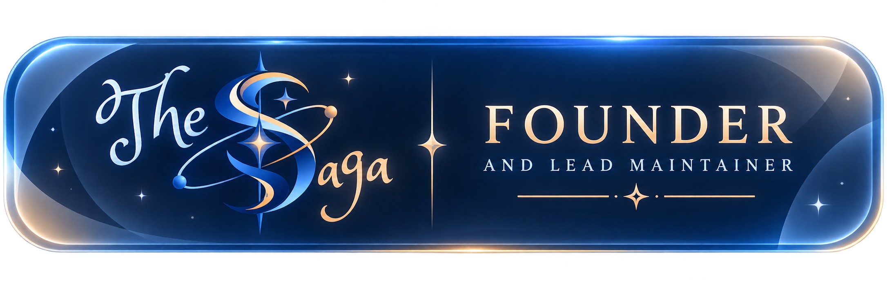
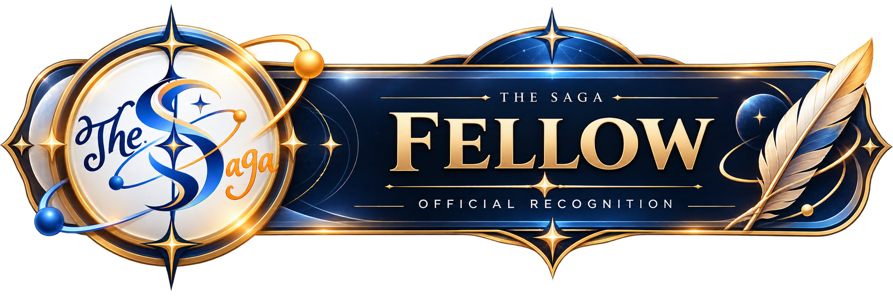
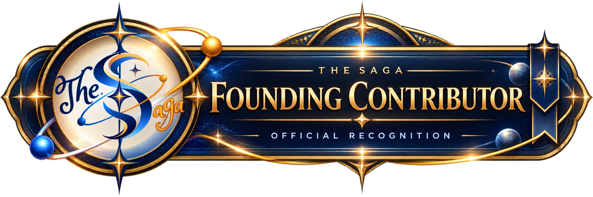
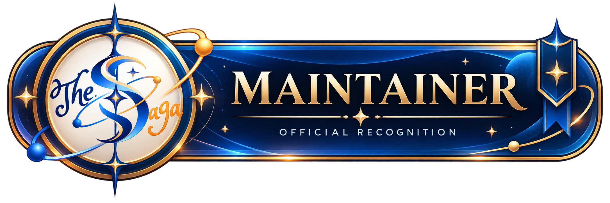
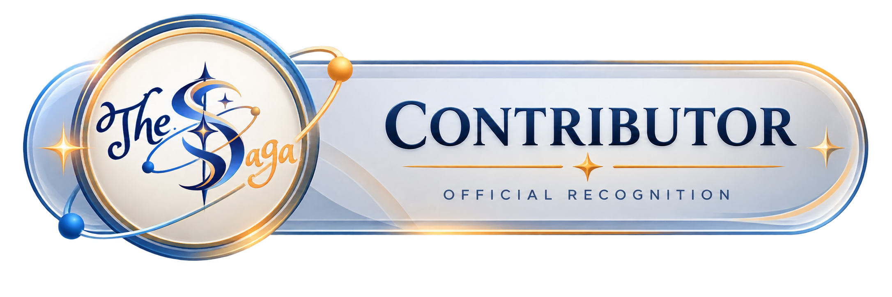

# The Saga — Recognition Policy

Rarity and meaning of The Saga's official recognition badges.

These badges are official recognition for meaningful contribution, responsibility,
and exceptional service to The Saga. **They are recognition, not licenses,
permissions, ownership rights, or employment titles.**

---

## 1. Founder & Lead Maintainer

**Rarity: Unique**

Recognizes the person who founded The Saga and currently serves as its lead
maintainer.

This is a unique recognition intended for the founder and current lead of the
initiative. It is not a contribution rank and is not awarded through normal
contributor progression.

---

## 2. Saga Fellow

**Rarity: Extremely rare**

The highest recognition for exceptional contribution.

Granted to individuals who:

- Demonstrate sustained and exceptional contributions.
- Contribute meaningfully across all three tiers — Tier I (The Saga Architecture),
  Tier II (Sorophy™), and Tier III (Myriad Ecosystem).
- Materially influence the development, direction, or long-term growth of The Saga.
- Demonstrate long-term commitment to the initiative.

Saga Fellow is appointment-only and intentionally rare. It is not awarded simply for
commit count, popularity, financial contribution, or a single major contribution.

---

## 3. Founding Contributor

**Rarity: Very rare**

Recognizes individuals who made meaningful contributions during the foundational
development of The Saga and helped establish its architecture, implementation,
ecosystem, or direction.

A Founding Contributor does **not** need to have contributed to all three tiers. The
recognition is based on the historical importance and foundational nature of the
contribution.

This is intended to become a closed historical category once The Saga's founding
period has ended.

---

## 4. Saga Maintainer

**Rarity: Rare**

Recognizes an individual entrusted with ongoing responsibility for maintaining an
official or recognized part of The Saga.

A Maintainer should:

- Have demonstrated meaningful contribution.
- Have ongoing maintenance responsibility.
- Be trusted to review, improve, maintain, or make decisions regarding their assigned
  scope.
- Be officially appointed to the maintainer role.

Maintainer status does **not** require contributions across all three tiers. A
maintainer may be responsible for a specific scope within Architecture, Sorophy™, or
the Myriad Ecosystem.

Maintainer is a role of responsibility, not a higher contribution rank.

---

## 5. Saga Contributor

**Rarity: Uncommon**

Recognizes individuals who have made meaningful contributions across all three tiers
of The Saga — Tier I (The Saga Architecture), Tier II (Sorophy™), and Tier III
(Myriad Ecosystem).

A contribution must be **meaningful** rather than merely incidental. Contributing to
only one or two tiers does not qualify an individual for Saga Contributor recognition.
The purpose is to recognize people who have contributed to The Saga as a whole,
rather than to only one component.

---

## Rarity Order

From rarest to most commonly attainable:

1. Founder & Lead Maintainer — Unique
2. Saga Fellow — Extremely rare
3. Founding Contributor — Very rare
4. Saga Maintainer — Rare
5. Saga Contributor — Uncommon

---

## Important Distinction

The badges do not form a simple promotion ladder.

- **Founder & Lead Maintainer** and **Founding Contributor** are primarily
  historical/founding recognitions.
- **Saga Contributor** recognizes broad contribution across all three tiers.
- **Saga Maintainer** recognizes entrusted ongoing responsibility and can exist
  independently of contributor rank.
- **Saga Fellow** recognizes exceptional, sustained contribution and influence across
  The Saga.

Recognition is granted by The Saga according to the applicable criteria above and
recorded in the official [Registry](./Registry.md).
